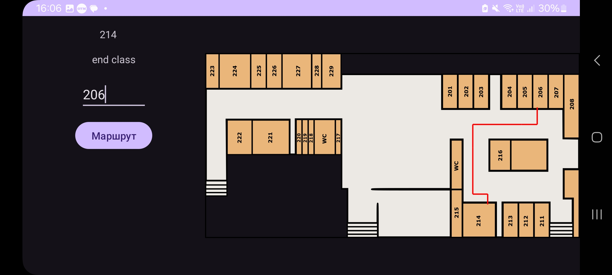

# Campus Navigation System


Система навигации по учебному заведению с использованием NFC меток для автоматического определения текущего положения и построения оптимального маршрута.

## Основные возможности

- **Автоматическое определение местоположения** через NFC метки
- **Визуализация маршрута** на интерактивной карте этажа
- **Расчет времени пути** с учетом расстояния
- **Простой интерфейс** с минимальными действиями пользователя
- **Адаптивный алгоритм** поиска кратчайшего пути (BFS)

## Пример работы приложения

Построение маршрута между 215 и 222 кабинетом


Построение маршрута между 214 и 206 кабинетом




Построение маршрута между 214 и 207 кабинетом


## Технологии

- **Язык**: Kotlin 100%
- **Архитектура**: Single Activity
- **NFC**: Android NFC Reader API
- **Алгоритм**: Поиск в ширину (BFS)
- **Визуализация**: Custom View с анимацией
- **Минимальная версия Android**: 8.0 (API 26)

## Структура проекта

```bash
CampusNavigator/
├── .gitignore             # Игнорируемые файлы
├── README.md              # Документация проекта
├── app/
│   ├── build.gradle.kts   # Конфигурация модуля
│   └── src/
│       ├── main/
│       │   ├── AndroidManifest.xml
│       │   ├── java/com/example/myapplication/
│       │   │   └── MainActivity.kt      # Основная логика приложения
│       │   └── res/
│       │       ├── drawable/
│       │       │   ├── ic_launcher_*.xml # Иконки приложения
│       │       │   └── second_floor.png  # План этажа
│       │       ├── layout/
│       │       │   └── activity_main.xml # Главный экран
│       │       └── values/               # Ресурсы приложения
│       └── test/                         # Юнит-тесты
├── gradle/
│   └── wrapper/                         # Gradle wrapper
├── gradle.properties                    # Настройки Gradle
└── settings.gradle.kts                  # Настройки проекта
```

## Быстрый старт

### Требования
- Android устройство с NFC (API 26+)
- Android Studio Electric Eel или новее
- NFC метки с записанными идентификаторами

### Установка
1. Клонируйте репозиторий:
   ```bash
   git clone https://github.com/JakovManishek/NFC_Application.git

- Откройте проект в Android Studio
- Настройте NFC метки (измените nfcIdMap в MainActivity.kt)
- Запустите на устройстве через Run 'app'
